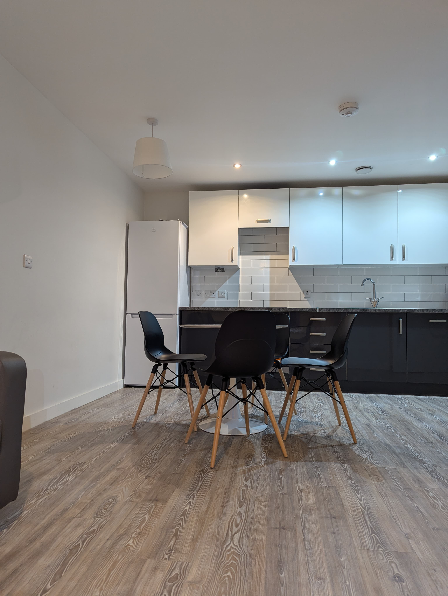
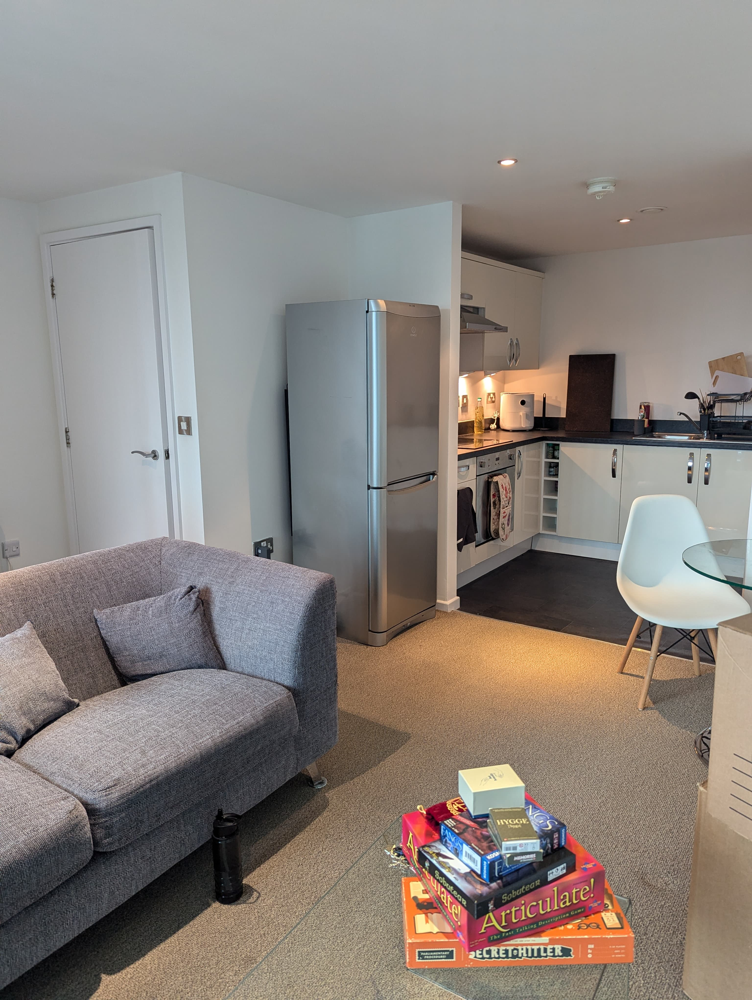
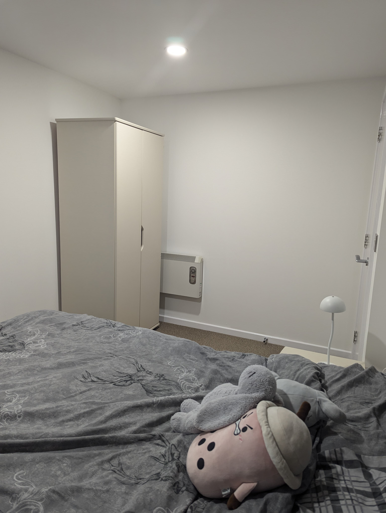

I've been counting down the days for this for almost six months, and now it's finally happening - I'm moving into my own place for the first time!

Having my own space has always meant a lot to me because I can do anything and absolutely anything to my space. And for some reason, it also makes me feel more confident to face life as authentically as possible.

As I write this, I moved out of my old place one week ago where I used to live with my flatmate. It was fun making so many new memories here - especially all the board game nights and dinner parties. But after long days at work, I'd come home, but it didn't feel like home in the way I wanted it to.

It was a lovely place, but it just wasn't very 'homely':

Unfortunately, this is the only photo I have when we were moving out - FYI, the flat was cleaned with blood, sweat and tears three days before said photo was taken.

Funny enough, I realised that this exciting feeling was quite close to how I feel when I solo travel. There is a type of growth that comes from being on your own, doing things you normally wouldn't. With my flatmate, I got comfortable in a routine. I felt less inclined to organise social events and meet up with people apart from my flatmate and my familiar friend group. Now that I've moved, I'm already looking into photography school, creating a casual frisbee group in the city, and make my first post on this blog (all things that I never considered doing before).

Super excited for this new chapter in my life! Here are some photos of my new flat so far. It's still a work in progress, and I'll share the final tour in another post when I finish decorating.

I honestly can't wait to see how everything comes together, both in the new place and this new chapter in life. It's surprising how having a new space can open up many opportunities. 

Till then c:

